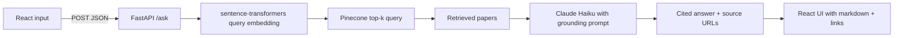

# ArXiv Navigator

**Semantic search and cited Q&A over recent AI research papers.**

ArXiv Navigator is a full-stack RAG (Retrieval-Augmented Generation) application that lets you ask natural language questions over a curated corpus of recent cs.AI and cs.LG papers from ArXiv. Each query returns a grounded answer generated by Claude, with citations linking directly to the source papers.

> **Note:** For research exploration and educational use. Answers are grounded in retrieved papers but should be verified against primary sources.

---

## Project overview

Users enter a natural language question about AI or machine learning research. The backend embeds the query, retrieves the top semantically relevant papers from Pinecone, and sends them as context to Claude, which returns a cited, grounded answer. The frontend renders the response with clickable source links to the original ArXiv papers.

The ingestion pipeline runs separately — it fetches recent papers from the ArXiv API, embeds each abstract locally using `sentence-transformers`, and upserts vectors into Pinecone with title, text, and URL metadata.

---

## Live demo

| Service | URL |
|---------|-----|
| **App** | https://arxiv-navigator.vercel.app |
| **API** | https://KrishRamani-arxiv-navigator.hf.space |

The production frontend calls `POST /ask` on the hosted backend. Interactive API docs are available at the backend's `/docs` route.

---

## Tech stack

| Layer | Technologies |
|-------|--------------|
| **Embeddings** | `sentence-transformers` (`all-MiniLM-L6-v2`, 384-dim), running on PyTorch |
| **Vector DB** | Pinecone — stores title, text, and URL metadata per paper (cosine similarity) |
| **LLM** | Claude Haiku (temperature 0.3) via the Anthropic API |
| **Ingestion** | ArXiv API — cs.AI + cs.LG categories, 200 recent papers |
| **Backend** | FastAPI, Uvicorn, Pydantic — containerized with Docker, deployed on Hugging Face Spaces |
| **Frontend** | React (Vite), react-markdown — deployed on Vercel |

---

## How it works



1. **Ingestion** — The ingestion script fetches up to 200 recent papers from the ArXiv API across cs.AI and cs.LG, extracts title, abstract text, and URL, embeds each abstract with `all-MiniLM-L6-v2`, and upserts into Pinecone.
2. **Query embedding** — The user's question is embedded with the same model to ensure vector space alignment.
3. **Retrieval** — Pinecone returns the most semantically similar papers by cosine similarity, with their metadata.
4. **Generation** — Claude Haiku receives the retrieved abstracts as context with a strict grounding instruction: answer only from the provided papers.
5. **Response** — Example shape:

   ```json
   {
     "answer": "Recent work on efficient video generation suggests...",
     "sources": [
       {
         "title": "VideoMLA: Low-Rank Latent KV Cache for Autoregressive Video Diffusion",
         "url": "https://arxiv.org/abs/XXXX.XXXXX"
       }
     ]
   }
   ```

---

## Key technical decisions

- **Embedding model** — `all-MiniLM-L6-v2` (via `sentence-transformers`) was chosen for strong semantic performance at small size (384-dim), running locally and free of per-call embedding costs. The same model is used for both ingestion and query embedding to keep the vector space aligned.
- **Abstracts-only indexing** — Each paper is indexed by its title and abstract rather than full text. Abstracts carry high semantic signal, which keeps the corpus simple and retrieval fast at this scale; full-text ingestion is a possible future extension.
- **Temperature 0.3** — Claude Haiku runs at 0.3 to keep answers consistent and grounded while retaining natural fluency.
- **Grounding instruction** — The prompt explicitly instructs the model to answer only from the provided papers, which minimizes hallucination on topics outside the retrieved context.
- **Pydantic validation** — Incoming requests are validated with a Pydantic schema before hitting the retrieval pipeline, ensuring clean inputs and informative errors.
- **Containerized deployment** — The backend loads a PyTorch embedding model, which exceeds typical free-tier memory limits. It is packaged with Docker and deployed on Hugging Face Spaces, which provides enough memory to host the model.

---

## Repository structure

```
arxiv-navigator/
├── backend/
│   ├── main.py              # FastAPI app and /ask endpoint (embed, retrieve, generate)
│   ├── ingest.py            # ArXiv API fetch, embed, and Pinecone upsert
│   └── requirements.txt
└── frontend/
    └── src/App.jsx          # Query input, answer display, source links
```

---

## Local setup

### Prerequisites

- **Node.js** 18+ and npm (frontend)
- **Python** 3.13 (backend)
- **API keys** — set in a `.env` file: `ANTHROPIC_API_KEY`, `PINECONE_API_KEY`

### Backend

```bash
cd backend
python -m venv venv
source venv/bin/activate   # Windows: venv\Scripts\activate
pip install -r requirements.txt

# Ingest papers into Pinecone (run once, or to refresh the corpus)
python ingest.py

uvicorn main:app --reload --host 127.0.0.1 --port 8000
```

API docs: http://127.0.0.1:8000/docs

### Frontend

```bash
cd frontend
npm install
npm run dev
```

Open the URL Vite prints (default http://localhost:5173).

**Point the UI at your local API:** In `frontend/src/App.jsx`, set `API_URL` to `http://127.0.0.1:8000/ask` while developing. The committed default targets the production backend.

### Quick API test

```bash
curl -X POST http://127.0.0.1:8000/ask \
  -H "Content-Type: application/json" \
  -d '{"question": "What are recent methods for efficient video generation?"}'
```

### Production deployment

- **Frontend:** Deployed on Vercel from the `frontend/` directory (Vite build).
- **Backend:** Containerized with Docker and deployed on Hugging Face Spaces. API keys are set as Space secrets (`ANTHROPIC_API_KEY`, `PINECONE_API_KEY`); the app listens on port 7860.
