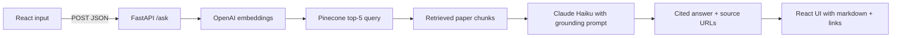

# ArXiv Navigator

**Semantic search and cited Q&A over recent AI research papers.**

ArXiv Navigator is a full-stack RAG (Retrieval-Augmented Generation) application that lets you ask natural language questions over a curated corpus of recent cs.AI and cs.LG papers from ArXiv. Each query returns a grounded answer generated by Claude, with citations linking directly to the source papers.

> **Note:** For research exploration and educational use. Answers are grounded in retrieved papers but should be verified against primary sources.

---

## Project overview

Users enter a natural language question about AI or machine learning research. The backend embeds the query, retrieves the top-5 semantically relevant papers from Pinecone, and sends them as context to Claude Haiku, which returns a cited, grounded answer. The frontend renders the response with clickable source links to the original ArXiv papers.

The ingestion pipeline runs separately — it fetches recent papers from the ArXiv API, embeds each abstract using OpenAI's `text-embedding-3-small`, and upserts vectors into Pinecone with title, abstract, and URL metadata.

---

## Live demo

| Service   | URL |
|-----------|-----|
| **App**   | Coming soon |
| **API**   | Coming soon |

The production frontend calls `POST /ask` on the hosted backend. The API root (`GET /`) returns a health check: `{"status": "ArXiv Navigator is running"}`.

---

## Tech stack

| Layer          | Technologies |
|----------------|--------------|
| **Embeddings** | OpenAI `text-embedding-3-small` (1536-dim) |
| **Vector DB**  | Pinecone — stores title, abstract, and URL metadata per paper |
| **LLM**        | Claude Haiku (temperature 0.3) via Anthropic API |
| **Ingestion**  | ArXiv API — cs.AI + cs.LG categories, 200 most recent papers |
| **Backend**    | FastAPI, Uvicorn, Pydantic — deployed on Hugging Face Spaces |
| **Frontend**   | React, react-markdown — deployed on Vercel |

---

## How it works



1. **Ingestion** — The ingestion script fetches up to 200 recent papers from the ArXiv API across cs.AI and cs.LG, extracts title, abstract, and URL, embeds each abstract with `text-embedding-3-small`, and upserts into Pinecone.
2. **Query embedding** — The user's question is embedded with the same model to ensure vector space alignment.
3. **Retrieval** — Pinecone returns the top-5 most semantically similar paper chunks by cosine similarity.
4. **Generation** — Claude Haiku receives the retrieved abstracts as context with a strict grounding instruction: answer only from the provided papers and cite each claim.
5. **Response** — Example shape:

   ```json
   {
     "answer": "Recent work on RLHF suggests... [1]",
     "sources": [
       {
         "title": "Reinforcement Learning from Human Feedback: A Survey",
         "url": "https://arxiv.org/abs/2312.XXXXX"
       }
     ]
   }
   ```

---

## Key technical decisions

- **Embedding model** — `text-embedding-3-small` was chosen over larger alternatives for its strong semantic performance at lower cost and latency, keeping retrieval fast without sacrificing relevance quality.
- **Chunk strategy** — Each paper is indexed as a single chunk (title + abstract). Full-text ingestion was considered but abstracts contain sufficient signal for semantic matching at this corpus size.
- **Temperature 0.3** — Claude Haiku is set to 0.3 to keep answers consistent and grounded while retaining natural fluency. Lower values produced overly rigid responses; higher values drifted from the retrieved context.
- **Grounding instruction** — The system prompt explicitly instructs the model to answer only from the provided papers and to cite each claim. This minimizes hallucination on topics outside the retrieved context.
- **Semantic caching** — Repeated or near-duplicate queries are served from a local cache by comparing query embeddings against previously seen vectors, reducing redundant Pinecone and Claude API calls.
- **Eval loop** — A retrieval evaluation step logs chunk-query cosine similarity scores per request, enabling iterative tuning of the chunking strategy and similarity threshold without manual inspection.
- **Pydantic validation** — All incoming requests are validated with a Pydantic schema before hitting the retrieval pipeline, ensuring clean inputs and informative error responses.

---

## Repository structure

```
arxiv-navigator/
├── backend/
│   ├── main.py              # FastAPI app and /ask endpoint
│   ├── ingest.py            # ArXiv API fetch, embed, and Pinecone upsert
│   ├── retriever.py         # Query embedding and Pinecone similarity search
│   ├── generator.py         # Claude Haiku prompt construction and API call
│   ├── cache.py             # Semantic caching layer
│   └── requirements.txt
└── frontend/
    ├── src/App.js           # Query input and answer display
    ├── src/SourceList.js    # Clickable source paper links
    └── package.json
```

---

## Local setup

### Prerequisites

- **Node.js** 18+ and npm (frontend)
- **Python** 3.10+ (backend)
- **API keys** — set in a `.env` file: `OPENAI_API_KEY`, `ANTHROPIC_API_KEY`, `PINECONE_API_KEY`, `PINECONE_INDEX_NAME`

### Backend

```bash
cd backend
python -m venv venv
source venv/bin/activate   # Windows: venv\Scripts\activate
pip install -r requirements.txt

# Ingest papers into Pinecone (run once, or to refresh the corpus)
python ingest.py

uvicorn main:app --reload --host 127.0.0.1 --port 8000
```

API docs: [http://127.0.0.1:8000/docs](http://127.0.0.1:8000/docs)

### Frontend

```bash
cd frontend
npm install
npm start
```

Open [http://localhost:3000](http://localhost:3000).

**Point the UI at your local API:** In `frontend/src/App.js`, set `API_URL` to `http://127.0.0.1:8000/ask` while developing. The committed default targets the production backend.

### Quick API test

```bash
curl -X POST http://127.0.0.1:8000/ask \
  -H "Content-Type: application/json" \
  -d '{
    "question": "What are the latest approaches to reducing hallucinations in large language models?"
  }'
```

### Production builds

- **Frontend:** `npm run build` from `frontend/` (static output in `frontend/build/`, suitable for Vercel)
- **Backend:** Deployed via Docker on Hugging Face Spaces; ensure `.env` variables are set as Spaces secrets and `requirements.txt` is up to date
